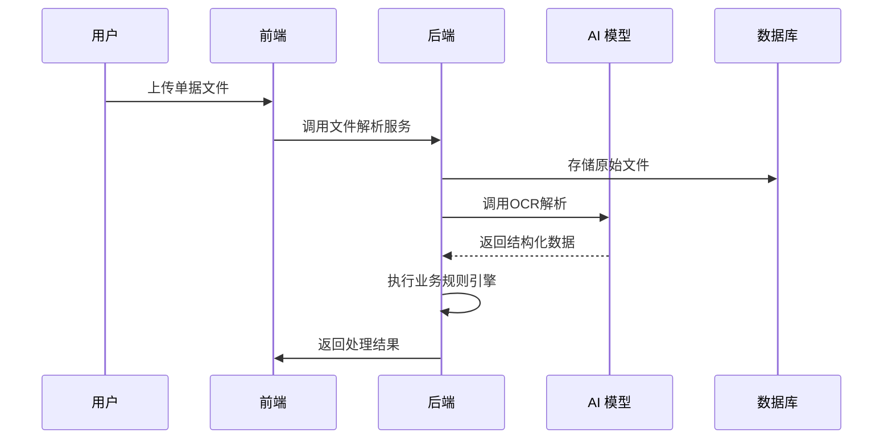
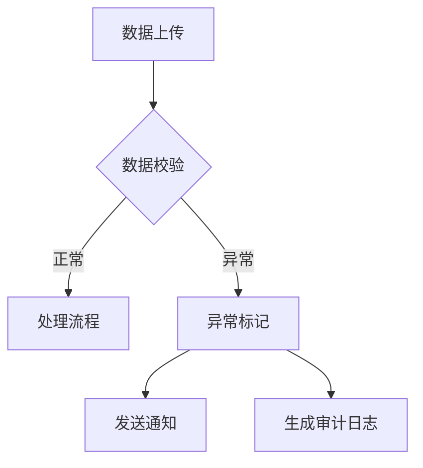

# Fia财金产品需求文档README

## 一、项目概述

### （一）项目目标

开发一款集成多财务审计金融相关功能的 SaaS  AI网页智能体应用，集成AI大模型能力，旨在满足企业和财务人员在财务金融学习、财务处理、审计、经营分析、金融分析等方面的需求，为财务审计金融人员及相关业务用户提供更多高效、便捷的财务处理、审计以及数据分析等解决方案。涵盖会计准则问答、财务处理、审计以及财务经营分析四大核心功能模块，通过自动化处理和智能分析，提高工作效率和准确，助力企业提升财务管理水平，降低风险，辅助管理者做出科学决策。

提供精准的会计准则解答，帮助财务人员快速解决日常会计财务问题。

实现财务处理流程的自动化与智能化，提高工作效率，减少人为错误。

为审计工作提供有力支持，高效完成文件数据核对以及风险分析，确保企业财务数据真实、准确、完整。

深入开展财务经营分析，通过数据问答、可视化展示以及分析报告等功能，助力企业洞察经营状况，支持战略决策。

### （二）受众

**企业财务人员**：负责企业日常财务处理工作，使用本应用进行单据处理、记账、账务管理等，借助会计准则问答解决工作中的问题，利用财务经营分析功能了解企业财务数据。

**审计机构及从业人员：**进行文件数据核对、审计风险分析等审计工作，生成审计说明和结论。

**中小企业主/管理人员：**通过财务经营分析功能获取财务分析报告、可视化数据等，了解企业财务状况和经营成果，为企业战略决策提供依据。

**财务相关研究者或学生**：可利用会计准则问答等功能学习财务知识，了解实际财务处理流程。

**金融/咨询等专业机构及人员：**借助本应用的财务数据查询与分析功能，快速获取企业的财务信息，为金融评估、投资分析、咨询服务等提供精准的数据支持，从而更好地为客户提供专业的金融方案和咨询建议，助力企业融资、并购等业务的开展。

### （三）应用场景

**会计准则问答场景** ：财务人员在日常处理账务过程中遇到对会计准则理解模糊或实际应用问题时，随时通过该应用获取准确的解答，确保财务核算符合规定。

**财务处理场景** ：在处理大量发票、银行流水、出入库单、合同等单据以及进行记账工作时，财务人员利用本应用批量生成台账、会计分录，高效完成财务处理任务，并针对复杂合同条款能获取相应的会计处理建议。

**审计场景** ：审计人员在开展审计工作时，使用该应用对被审计单位上传的各类文件数据进行核对，找出异常值并分析原因，依据审计风险分析模型进行风险评估，生成审计说明与结论，执行相关审计程序。

**财务经营分析场景** ：企业管理层或财务分析人员上传财务报表、数据文档等，通过数据问答功能快速获取关心的财务指标信息，借助数据可视化直观呈现经营状况，依据系统生成的分析报告及 PPT 了解企业财务全貌，同时利用内置分析模型以及可自定义分析模型功能深入分析数据，辅助经营决策。

## 二、功能架构

- 会计准则问答
  - 大禹智海财务大模型集成
- 批量台账
  - 批量生成台账（发票/流水/合同等）
- 财务处理
  - 批量记账（销项/进项发票等）
  - 复杂账务处理（合同条款分析）
- 审计
  - 文件数据核对（异常值标记）
  - 审计风险分析（模型+准则执行）
- 财务经营分析
  - 数据问答（文档检索分析）
  - 数据可视化
  - 分析报告生成（含PPT）
  - 分析模型管理（内置+自定义）

### （一）核心功能模块

**问答模块** ：接收用户输入的会计、审计、金融、财务等问题，经过模型分析处理，返回准确详细的解答内容。

**财务处理模块**

**批量生成台账功能** ：支持多种常见单据上传（发票、银行流水、出入库单、合同等），自动解析单据内容，按照既定规则整理生成相应台账，并提供输出下载接口。

**批量记账功能** ：允许用户批量导入销项税发票、进项税发票、银行流水等文件，依据财务记账规则自动生成会计分录，支持查看、编辑以及导出分录结果。

**复杂账务处理功能** ：对复杂合同条款以及相关发票、付款信息进行分析，结合财务处理原则给出针对性的会计处理建议。

**审计模块**

**文件数据核对功能** ：接收用户上传的各类表格、文件，建立数据关联，核对数据一致性，标记异常值并提供详细分析与结论。

**审计风险分析功能** ：运用审计风险分析模型，结合数据分析以及细节测试手段，识别潜在风险点，依据审计准则与风险模型执行审计程序，生成审计说明、审计结论等文档。

**财务经营分析模块**

**数据问答功能** ：用户上传数据文档后，根据自然语言提问方式，对文档数据内容进行检索、总结以及分析，返回相应的答案。

**数据可视化功能** ：对上传的数据进行可视化展示，提供多种图表类型选择，用户可自定义配置可视化界面，直观呈现数据趋势与关系。

**分析报告功能** ：依据用户上传的报表等数据，按照预设的财务分析模板生成完整的财务分析报告以及对应 PPT，涵盖财务指标分析、经营状况评估等内容。

**内置分析模型与自定义分析模型功能** ：内置常见财务分析模型，如财务比率分析、趋势分析等，对数据进行自动分析并生成可视化面板，同时允许用户新增自定义分析模型，满足个性化分析需求。

### （二）模块关系

各功能模块之间存在数据交互和共享。例如，财务处理模块生成的台账、会计分录等数据可作为审计模块和财务经营分析模块的输入数据；审计模块的分析结果和风险提示可为财务处理和财务经营分析提供参考；财务经营分析模块的分析结论和建议可反馈给企业管理者，指导财务处理和审计工作。会计准则问答模块为其他模块提供知识支持，帮助用户理解和处理相关财务问题。

## （三）项目结构目录

根据实际情况生成，确保符合规范
# 三、业务流程

## **核心处理流程：**

异常处理流程

### （一）会计准则问答流程

用户登录后在会计准则问答页面输入会计财务问题。

系统将问题发送至大禹智海财务大模型进行处理。

大模型返回回答结果，系统将其展示给用户。

### （二）批量生成台账流程

用户在财务处理模块选择批量生成台账功能，上传发票、银行流水、出入库单、合同等单据。

系统对上传的单据进行解析，提取关键信息，如单据类型、日期、金额、涉及主体等。

按照一般台账格式对提取的信息进行整理和分类。

生成台账并提供给用户，用户可查看、下载或导出台账。

### （三）批量记账流程

用户在财务处理模块选择批量记账功能，批量上传销项税发票、进项税发票、银行流水等文件。

系统解析文件内容，提取发票金额、发票号码、开票日期、银行流水的收支项目、账户信息等数据。

依据会计准则和企业记账规则生成会计分录初稿，将提取的数据匹配到相应的会计科目，生成会计分录。

展示生成的会计分录供用户核对，用户确认无误后保存，系统将会计分录存储到数据库。

### （四）复杂账务处理流程

用户上传复杂合同、相关发票及首收付款信息等资料。

系统对合同条款进行分析，提取关键财务条款，如付款方式、结算周期、税率等。

结合发票和付款信息，分析业务的经济实质和财务影响。

根据会计准则和企业的会计政策，生成会计处理建议，展示给用户，用户可参考建议进行账务处理。

### （五）文件数据核对流程

用户在审计模块上传需要核对的表、文件等数据。

系统确定数据之间的关联关系，如不同表格中的相同字段、数据之间的逻辑关系等。

对关联数据进行逐一核对，比较实际数据与预期数据是否一致。

标出异常值，分析异常产生的原因，生成数据核对报告，包含异常情况说明、分析结果和结论。

### （六）审计风险分析流程

用户上传被审计单位的财务数据文件等。

系统根据审计风险分析模型，对用户上传的审计数据、资料进行多维分析，运用细节测试等方法检查数据中的异常之处，识别潜在审计风险点。

按照审计准则执行相应的审计程序，记录审计过程和结果。

按照审计准则和风险模型确定的审计程序，系统生成相应的审计说明文档，分析风险程度，得出审计结论并展示给用户。

### （七）数据问答流程

用户上传数据文档后，在财务经营分析模块的数据问答功能中输入提问。

系统对数据文档进行索引和解析，理解用户的提问意图。

在文档数据中进行检索，提取相关数据进行总结和分析。

将分析结果以文字形式回答用户的提问。

### （八）数据可视化流程

用户上传包含数据的文档，选择数据可视化功能。

系统解析文档数据，根据数据类型和特征选择合适的可视化图表类型，如折线图、柱状图、饼图、散点图等。

生成可视化图表，展示数据的趋势、分布、对比等特征，用户可对图表进行交互操作，如缩放、筛选、查看数据详情等。

### （九）分析报告生成流程

用户上传报表等数据，选择生成财务分析报告和 PPT 功能。

系统对报表数据进行分析，包括财务指标计算、趋势分析、对比分析等。

根据分析结果，生成完整的财务分析报告文档供用户下载查看。

如用户选择同时生成PPT，根据财务分析报告生成对应PPT供用户下载查看。

### （十）内置分析模型使用及新增流程

**内置分析模型使用**：用户上传数据后，选择内置的分析模型，系统运用该模型对数据进行分析，展示分析结果。

**新增分析模型**：用户在系统中进入分析模型管理界面，定义新模型的名称、描述、输入数据要求、分析算法和输出结果格式等信息。系统验证模型的有效性和合理性后，将其添加到系统中，用户可在后续分析中使用该新增模型。

## 四、技术栈

### （一）前端技术栈

**1. 框架：**  • Next.js 15.2.4 (React 框架)  • React 19  • TypeScript 

**2. 样式解决方案：**  • Tailwind CSS  • PostCSS  • class-variance-authority (用于组件样式变体)  • tailwind-merge (用于合并 Tailwind 类名)  • tailwindcss-animate (动画支持)

**3. UI 组件库 :** • Radix UI (完整的组件库)  • Lucide React (图标库)  • Vaul (抽屉组件)  • Shadcn UI (基于 Radix UI 的组件库)  • Ant Design Charts (数据可视化)  • React Flow (流程图展示)  • React Table (表格处理)  •Mantine  •  Chakra UI   •Ant Design Vue/Element Plus

**4. 表单处理 :** • React Hook Form  • Zod (表单验证)  • @hookform/resolvers  **  • Y**up  • Final Form

**5. 状态管理：**  • React Hooks  • next-themes (主题管理) •  zustand@4.x •  @reduxjs/toolkit@2.x 

**6. 数据可视化：** • Recharts (图表库)  • ECharts (复杂图表)   • D3.js (自定义可视化)

**7. 工具库：**  • date-fns (日期处理)  • clsx (类名管理)  • sonner (Toast 通知)

**8.文件处理：**  • react-dropzone (文件上传)  • xlsx (Excel 文件处理)  • pdf.js (PDF 文件处理)

**9. 富文本：**react-markdown@9.x, slate-react@0.7.x（如需编辑） ;

**10.代码编辑：**codemirror@6.x 或 @monaco-editor/react@7.x ;

**11.测试：**jest@29.x, react-testing-library@14.x, cypress@13.x ;

**12.差异显示：**diff-match-patch@1.0.x ;

**13.权限：**next-auth@5.x, @auth/core@2.0.x ;

**14.多文件预览：**引入 react-file-viewer（支持多种格式预览）或 @mui/x-file-preview（MUI 生态，兼容性强）。

**（二）后端技术栈**

核心框架

• Python + FastAPI（高性能API框架）

数据库

• supabase

文件处理与存储

• 文件解析：Apache POI、PyMuPDF、Pandas、OCR

• 存储系统：MinIO（自托管对象存储）或 AWS S3（云存储）

• 分布式文件处理：Apache Tika/textract（内容提取）

任务队列与异步处理

• Celery + RabbitMQ/Redis（后台任务如台账生成、批量记账）

• Dask

**（三）AI与数据处理技术**

大模型集成

• 大禹智海API、通义点金API、DeepseekAPI

自然语言处理（NLP）

• spaCy/NLTK（实体识别、意图分类）

• Rasa（对话管理，用于数据问答模块）

OCR与数据提取

• 阿里云OCR

数据分析与建模

• Polars（结构化数据处理）

• Scikit-learn/XGBoost/pyFraud（审计风险分析模型）

• Prophet/statsmodels（财务趋势预测）

可视化与报告生成

• Plotly/Matplotlib/Apache ECharts（后端生成图表数据）

• Jinja2 + WeasyPrint（HTML转PDF报告）

• python-pptx/Aspose.Slides（自动化生成PPT）

**（四）运维与监控**

基础设施

• Docker（容器化部署）

• Terraform（基础设施即代码）

• Prometheus + Grafana（系统监控）

CI/CD

• GitHub Actions/GitLab CI（自动化流水线）

• SonarQube（代码质量检测）

测试

• Pytest/Unittest（单元测试）

• Locust/JMeter（压力测试）

## 五、前端设计指南

### （一）用户界面设计原则

**简洁易用**：界面布局简洁明了，避免过多的复杂元素，功能按钮和操作流程直观易懂，降低用户的学习成本。

**一致性**：整体界面风格一致，包括颜色搭配、字体使用、图标设计等，保证用户在使用过程中的视觉连贯性。

**响应式设计**：支持不同设备和屏幕尺寸的访问，如桌面电脑、平板、手机等，确保界面在各种设备上都能正常显示和操作。

在具体功能页面内，合理划分数据输入输出区域、操作按钮区域以及结果展示区域，保证页面功能分区明确，用户操作流程顺畅，信息呈现清晰。

### （二）交互设计

**按钮和表单**：按钮设计要有明确的视觉反馈，如点击时的颜色变化、悬停效果、进度条等；表单输入框要有清晰的标签和提示信息，支持自动完成、校验等功能，提高用户输入效率和准确性。

**数据展示**：支持多列排序、筛选、搜索等功能，方便用户快速查找定位所需数据；在图表展示时，实现鼠标悬停显示详细数据信息、图表缩放、图例切换等交互效果，增强数据可视化分析的交互体验。

**反馈机制**：在用户进行操作时，提供及时的反馈，如加载进度条、成功或失败的提示信息等，让用户了解操作的状态和结果。

## 六、后端架构设计

### （一）整体架构

采用微服务架构，将系统拆分为多个独立的微服务模块，如用户服务、会计准则问答服务、批量台账服务、财务处理服务、审计服务、财务经营分析服务、文件存储服务等。每个微服务模块独立部署、运行，通过 API 网关进行统一的接口管理和路由转发，实现服务之间的通信和协作。

### （二）模块职责

**API 网关**：作为系统的入口，接收所有前端请求，根据请求的路径和参数，将请求转发到相应的微服务模块；同时进行身份认证、权限校验、限流、日志记录等操作，保证系统的安全性和稳定性。

**用户服务**：管理用户的注册、登录、权限分配等信息，维护用户的基本资料和角色信息。

**会计准则问答服务**：与大禹智海财务大模型进行交互，处理用户的问答请求，返回大模型的回答结果。

**财务处理服务**：负责处理批量生成台账、批量记账、复杂账务处理等业务逻辑，解析上传的单据和文件，生成相应的财务数据，并存储到数据库。

**审计服务**：实现文件数据核对、审计风险分析等功能，对上传的审计数据进行处理和分析，生成审计报告和结论。

**财务经营分析服务**：处理数据问答、数据可视化、分析报告生成、分析模型管理等业务，对上传的数据文档和报表进行分析和处理，提供相应的分析结果和可视化展示。

**文件存储服务**：管理用户上传的文件，将文件存储到 MinIO 等文件存储系统中，提供文件的上传、下载、删除等操作接口。

**数据库服务**：supabase为各个微服务模块提供数据支持。

**批量台账服务：**对用户上传的文件数据，批量生成excel台账。

### （三）数据交互

各微服务模块之间通过 RESTful API 进行数据交互，采用 JSON 格式作为数据传输格式。API 网关作为中间层，统一管理微服务的接口，实现服务之间的解耦和灵活调用。同时，使用消息队列（如 RabbitMQ）进行异步通信，处理一些耗时的操作，如文件解析、大数据分析等，提高系统的性能和吞吐量。

### （四）安全性设计

**身份认证和授权**：采用 JWT 令牌进行用户身份认证，用户登录成功后，后端生成 JWT 令牌返回给前端，前端在后续的请求中携带令牌，后端通过 API 网关进行令牌校验，验证用户的身份和权限。

**数据加密**：对敏感数据，如用户密码、财务数据等，在存储和传输过程中进行加密处理，采用 HTTPS 协议保证数据传输的安全性。

**访问控制**：根据用户的角色和权限，对不同的功能模块和数据资源进行访问控制，确保用户只能访问其有权限的内容。

**日志记录和监控**：对系统的操作日志、错误日志进行记录和分析，实时监控系统的运行状态，及时发现和处理安全隐患。

## 七、数据流

### （一）数据输入

**用户输入**：用户在会计准则问答页面输入问题，在财务处理、审计、财务经营分析等模块上传各种单据、文件、报表等数据。

**外部数据接口**：未来可考虑与外部财务系统、税务系统、银行系统等进行数据对接，获取相关财务数据。

### （二）数据处理

**前端处理**：对用户输入的数据进行初步校验和格式化，如文件格式校验、数据类型检查等，将符合要求的数据发送到后端。

**后端处理**：

**数据解析**：对上传的文件和单据进行解析，提取关键信息，如发票中的金额、日期、发票号码，合同中的条款内容等。

**业务逻辑处理**：根据不同的功能需求，执行相应的业务逻辑，如生成台账、会计分录，进行数据核对、风险分析，调用分析模型进行数据处理等。

**与外部模型交互**：在会计准则问答功能中，将用户问题发送到大禹智海财务大模型，接收并处理模型返回的回答结果。

### （三）数据存储

**结构化数据存储**：将用户信息、台账数据、会计分录、审计结果、分析报告等结构化数据存储到 MySQL 数据库中，建立合适的表结构和索引，确保数据的高效查询和更新。

**非结构化数据存储**：将用户上传的文件、合同文档、报表等非结构化数据存储到 MongoDB 数据库或 MinIO 文件存储系统中，记录文件的元数据信息，如文件名、文件类型、上传时间、用户 ID 等。

### （四）数据输出

**前端展示**：将处理后的数据以页面的形式展示给用户，如台账列表、会计分录详情、审计报告、可视化图表、分析报告等，支持数据的查看、下载、导出等操作。

**文件输出**：生成 Excel、PDF、PPT 等格式的文件，供用户下载和使用，如台账文件、会计分录文件、财务分析报告和 PPT 等。

### （五）数据流转

用户在前端页面输入数据或上传文件，前端通过 Axios 等网络请求库将数据发送到后端 API 网关。

API 网关根据请求的路径和权限，将请求转发到相应的模块。

相应模块处理请求，进行数据解析、业务逻辑处理、与数据库或外部模型交互等操作，生成处理结果。

处理结果通过 API 网关返回给前端，前端将结果展示给用户，或生成文件供用户下载。

###